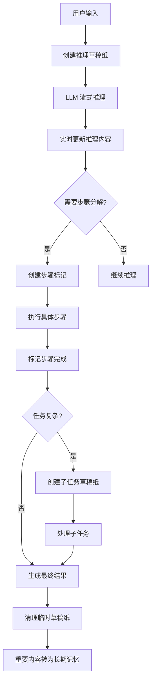

# OpenCode 记忆机制技术文档

## 概述

OpenCode 实现了多层次、智能化的记忆系统，支持复杂的多轮对话和代码协作场景。本文档详细描述 OpenCode 的记忆存储、检索、压缩和管理机制。

## 目录

- [1. 记忆系统架构](#1-记忆系统架构)
- [2. 记忆存储机制](#2-记忆存储机制)
- [3. 记忆检索技术](#3-记忆检索技术)
- [4. 记忆压缩策略](#4-记忆压缩策略)
- [5. 技术实现细节](#5-技术实现细节)
- [6. 性能优化](#6-性能优化)
- [7. 企业版扩展](#7-企业版扩展)

---

## 1. 记忆系统架构

### 1.1 多层次记忆设计

OpenCode 采用三级记忆架构：

- **短期记忆**：当前会话的实时上下文
- **长期记忆**：会话级持久化存储
- **规则记忆**：项目/全局级别的指令和偏好

### 1.2 核心组件

```
记忆系统组件：
├── Storage Layer (存储层)
├── Retrieval Engine (检索引擎)
├── Compression Manager (压缩管理器)
└── Context Builder (上下文构建器)
```

---

## 2. 记忆存储机制

### 2.1 存储技术栈

**核心存储方案**：本地文件系统 + JSON 序列化

**存储路径结构**：
```
~/.local/share/opencode/
├── storage/
│   ├── session/{projectID}/{sessionID}.json
│   ├── message/{sessionID}/{messageID}.json
│   └── part/{messageID}/{partID}.json
├── cache/
│   └── tool-output/
└── config/
    └── opencode.json
```

### 2.2 数据模型

#### Session 数据结构
```typescript
interface SessionInfo {
  id: string;                    // 会话唯一标识
  projectID: string;             // 关联项目ID
  title: string;                 // 会话标题
  summary?: {                   // 会话摘要
    additions: number;           // 新增代码行数
    deletions: number;          // 删除代码行数
    files: number;              // 涉及文件数
  };
  time: {
    created: number;            // 创建时间
    updated: number;           // 更新时间
  };
}
```

#### Message 和 Part 结构
```typescript
interface MessageInfo {
  id: string;                    // 消息ID
  sessionID: string;            // 所属会话ID
  role: 'user' | 'assistant' | 'system';
  model?: string;               // 使用的模型
  tokens?: {                    // Token统计
    input: number;
    output: number;
    reasoning?: number;
  };
}

// Part 类型系统
interface Part {
  id: string;
  type: 'text' | 'tool' | 'file' | 'compaction' | 'subtask';
  // ... 类型特定字段
}
```

### 2.3 存储操作接口

```typescript
// 存储层核心接口
export namespace Storage {
  export async function write<T>(key: string[], content: T);
  export async function read<T>(key: string[]): Promise<T>;
  export async function list(prefix: string[]): Promise<string[][]>;
  export async function remove(key: string[]);
}
```

---

## 3. 记忆检索技术

### 3.1 核心检索机制

#### 流式检索接口
```typescript
// 逆序流式读取会话记忆
export const stream = fn(Identifier.schema("session"), async function* (sessionID) {
  const list = await Array.fromAsync(await Storage.list(["message", sessionID]))
  for (let i = list.length - 1; i >= 0; i--) {
    yield await get({
      sessionID,
      messageID: list[i][2],
    })
  }
})
```

#### 智能边界检测
```typescript
export async function filterCompacted(stream: AsyncIterable<MessageV2.WithParts>) {
  const result = [] as MessageV2.WithParts[]
  const completed = new Set<string>()
  
  for await (const msg of stream) {
    result.push(msg)
    
    // 检测压缩边界
    if (msg.info.role === "user" && 
        completed.has(msg.info.id) && 
        msg.parts.some((part) => part.type === "compaction")) {
      break
    }
    
    // 标记完成的对话回合
    if (msg.info.role === "assistant" && msg.info.summary && msg.info.finish) {
      completed.add(msg.info.parentID)
    }
  }
  
  return result.reverse()
}
```

### 3.2 检索策略

#### 分层检索策略
1. **最近对话优先**：从最新消息开始检索
2. **工具调用相关**：保留重要工具的执行历史
3. **压缩摘要**：包含压缩后的对话摘要

#### 相关性评分算法
```typescript
function calculateRelevance(msg: MessageV2.WithParts, context: Context): number {
  let score = 0
  
  // 时间衰减因子
  const timeDiff = Date.now() - msg.info.time.created
  score += Math.max(0, 1 - timeDiff / (24 * 60 * 60 * 1000))
  
  // 工具调用相关性
  if (containsRelevantTools(msg, context.tools)) score += 2.0
  
  // 文件路径匹配
  if (matchesCurrentFiles(msg, context.files)) score += 1.5
  
  return score
}
```

### 3.3 性能优化

#### 并发检索
```typescript
// 并行读取多个parts
export const parts = fn(Identifier.schema("message"), async (messageID) => {
  const items = await Storage.list(["part", messageID])
  const partPromises = items.map(item => Storage.read<MessageV2.Part>(item))
  const results = await Promise.all(partPromises)
  return results.sort((a, b) => a.id.localeCompare(b.id))
})
```

#### 多级缓存
- **内存缓存**：常用检索结果缓存
- **文件缓存**：工具输出和搜索结果持久化
- **预加载策略**：相关会话记忆预加载

---

## 4. 记忆压缩策略

### 4.1 压缩触发机制

```typescript
export async function isOverflow(input: { 
  tokens: MessageV2.Assistant["tokens"]; 
  model: Provider.Model 
}) {
  const count = input.tokens.input + input.tokens.output + input.tokens.cache.read
  const reserved = Math.min(COMPACTION_BUFFER, ProviderTransform.maxOutputTokens(input.model))
  const usable = input.model.limit.input ? input.model.limit.input - reserved : context - reserved
  return count >= usable  // Token数超过阈值时触发压缩
}
```

### 4.2 双压缩策略

#### A. Prune 策略 - 工具输出压缩
```typescript
export async function prune(input: { sessionID: string }) {
  const msgs = await Session.messages({ sessionID: input.sessionID })
  let total = 0
  const toPrune = []
  
  // 从最新消息向后遍历
  for (let i = msgs.length - 1; i >= 0; i--) {
    const msg = msgs[i]
    for (const part of msg.parts) {
      if (part.type === "tool" && part.state.status === "completed") {
        const estimate = Token.estimate(part.state.output)
        total += estimate
        if (total > PRUNE_PROTECT) {
          toPrune.push(part)
        }
      }
    }
  }
  
  // 标记为已压缩状态
  for (const part of toPrune) {
    part.state.time.compacted = Date.now()
    await Session.updatePart(part)
  }
}
```

#### B. Compaction 策略 - 对话摘要
- 生成智能对话摘要
- 保留关键决策和代码变更
- 替代原始的大段对话内容

### 4.3 压缩保护机制

**保护的重要工具**：
- `skill` 工具：关键技能调用不被压缩
- 最近2轮对话：完整保留最新交互
- 代码变更记录：重要的重构决策

---

## 5. 技术实现细节

### 5.1 文件系统索引技术

**替代传统数据库的方案**：
- 使用目录结构作为天然索引
- 文件路径模式：`session/{sessionID}/message/{messageID}.json`
- Bun.Glob 进行高效的文件模式匹配

### 5.2 数据一致性保障

#### 文件锁机制
```typescript
export async function write<T>(key: string[], content: T) {
  const dir = await state().then((x) => x.dir)
  const target = path.join(dir, ...key) + ".json"
  
  using _ = await Lock.write(target)  // 文件锁确保并发安全
  await Bun.write(target, JSON.stringify(content, null, 2))
}
```

#### 数据迁移支持
```typescript
const MIGRATIONS: Migration[] = [
  async (dir) => {
    // 版本1到版本2的数据迁移
    await migrateV1ToV2(dir)
  },
  // ... 更多迁移
]
```

### 5.3 错误处理和恢复

```typescript
// 健壮的检索机制
async function robustRetrieve(sessionID: string, maxRetries: number = 3) {
  for (let attempt = 1; attempt <= maxRetries; attempt++) {
    try {
      return await MessageV2.filterCompacted(MessageV2.stream(sessionID))
    } catch (error) {
      if (attempt === maxRetries) throw error
      await sleep(attempt * 1000)  // 指数退避重试
    }
  }
}
```

---

## 6. 性能优化

### 6.1 内存优化策略

#### 流式处理避免内存爆炸
```typescript
// 使用生成器模式处理大规模数据
async function* processLargeHistory(sessionID: string) {
  for await (const msg of MessageV2.stream(sessionID)) {
    yield processMessage(msg)  // 逐个处理，不一次性加载所有数据
  }
}
```

#### 懒加载机制
- Parts 按需加载
- 大文件内容分块读取
- 工具输出延迟解析

### 6.2 检索性能优化

#### 索引优化
- 文件系统目录结构作为一级索引
- 内存中的消息ID缓存作为二级索引
- 最近访问模式优化

#### 查询优化
- 逆序读取优先处理最新数据
- 并行处理独立的检索任务
- 预计算常用查询路径

### 6.3 存储优化

#### 数据压缩
- JSON 序列化优化
- 重复内容去重
- 增量存储更新

#### 缓存策略
- LRU 缓存淘汰算法
- 分层缓存设计
- 缓存失效机制

---

## 7. 草稿纸（Scratchpad）机制

### 7.1 草稿纸机制概述

OpenCode 实现了完善的草稿纸机制，用于记录 LLM 的中间思考过程、任务分解和推理链。草稿纸机制是短期记忆的重要组成部分，提供了透明的 AI 决策过程和任务执行跟踪。

#### 核心草稿纸类型

```typescript
// 草稿纸类型系统
interface ScratchpadSystem {
  ReasoningPart:     // 推理过程记录
  StepStartPart:     // 步骤开始标记
  StepFinishPart:    // 步骤完成标记  
  SubtaskPart:       // 子任务分解
  CompactionPart:    // 压缩标记
}
```

### 7.2 推理草稿纸（ReasoningPart）

#### 数据结构定义

```typescript
export const ReasoningPart = PartBase.extend({
  type: z.literal("reasoning"),
  text: z.string(),                    // 推理过程文本内容
  metadata: z.record(z.string(), z.any()).optional(),  // 推理上下文元数据
  time: z.object({
    start: z.number(),                 // 推理开始时间戳
    end: z.number().optional(),        // 推理结束时间戳
  }),
})
```

#### 工作原理

**实时推理记录**：
```typescript
// 在 LLM 处理过程中实时记录推理过程
async function processWithReasoning(sessionID: string, userMessage: MessageV2.User) {
  // 创建推理草稿纸
  const reasoningPart = await Session.updatePart({
    type: "reasoning",
    text: "",  // 初始为空，LLM 会逐步填充
    time: { start: Date.now() }
  })
  
  // 流式处理 LLM 响应，实时更新推理内容
  const processor = new ReasoningProcessor(reasoningPart)
  await processor.processStreamingResponse(llmResponse)
  
  // 标记推理完成
  await Session.updatePart({
    ...reasoningPart,
    time: { ...reasoningPart.time, end: Date.now() }
  })
}
```

**推理内容示例**：
```
用户要求：实现用户登录功能

推理过程：
1. 分析需求：需要用户名/密码验证、会话管理、安全考虑
2. 技术选型：使用 JWT 令牌、bcrypt 密码加密
3. 架构设计：认证服务、中间件、路由保护
4. 实现步骤：数据库设计 → API 端点 → 前端集成
```

### 7.3 步骤标记系统

#### 步骤开始标记（StepStartPart）

```typescript
export const StepStartPart = PartBase.extend({
  type: z.literal("step-start"),
  description: z.string(),  // 步骤描述
  snapshot: z.string().optional(),  // 系统快照（可选）
})
```

#### 步骤完成标记（StepFinishPart）

```typescript
export const StepFinishPart = PartBase.extend({
  type: z.literal("step-finish"),
  result: z.string(),      // 步骤执行结果
  summary: z.string().optional(),  // 步骤摘要
})
```

#### 多步骤任务处理流程

```typescript
// 多步骤任务执行流程
async function executeMultiStepTask(sessionID: string, taskDescription: string) {
  // 步骤1：分析任务
  await Session.updatePart({
    type: "step-start",
    description: "分析任务需求和约束条件"
  })
  
  // 执行分析...
  const analysisResult = await analyzeTask(taskDescription)
  
  await Session.updatePart({
    type: "step-finish", 
    result: `识别出 ${analysisResult.subtasks.length} 个子任务`
  })
  
  // 步骤2：分解子任务
  await Session.updatePart({
    type: "step-start",
    description: "将复杂任务分解为可执行的子任务"
  })
  
  // 继续执行后续步骤...
}
```

### 7.4 子任务分解机制（SubtaskPart）

#### 子任务数据结构

```typescript
export const SubtaskPart = PartBase.extend({
  type: z.literal("subtask"),
  prompt: z.string(),       // 子任务提示文本
  description: z.string(),  // 子任务详细描述
  agent: z.string(),        // 指定使用的 agent
  command: z.string().optional(),  // 执行命令（可选）
})
```

#### 复杂任务分解示例

```typescript
// 将复杂编程任务分解为子任务
async function decomposeComplexTask(mainTask: string) {
  const subtaskPart = await Session.updatePart({
    type: "subtask",
    prompt: "实现用户认证系统",
    description: "包括登录、注册、权限验证、会话管理等功能",
    agent: "code-assistant"
  })
  
  // LLM 基于这个草稿纸生成具体的实现步骤
  const implementationPlan = await generateImplementationPlan(subtaskPart)
  
  return implementationPlan
}
```

### 7.5 草稿纸与记忆系统的交互

#### 草稿纸生命周期管理

```typescript
// 草稿纸的创建、使用和清理
class ScratchpadManager {
  private activePads = new Map<string, Scratchpad>()
  
  // 创建新草稿纸
  async createScratchpad(type: ScratchpadType, context: Context) {
    const pad = new Scratchpad(type, context)
    this.activePads.set(pad.id, pad)
    
    // 持久化存储
    await Storage.write(["scratchpad", pad.id], pad)
    
    return pad
  }
  
  // 清理过期的草稿纸
  async cleanupExpiredScratchpads() {
    const expired = await this.getExpiredScratchpads()
    for (const pad of expired) {
      this.activePads.delete(pad.id)
      await Storage.remove(["scratchpad", pad.id])
    }
  }
  
  // 将重要草稿纸转换为长期记忆
  async promoteToLongTermMemory(pad: Scratchpad) {
    if (pad.importance > IMPORTANCE_THRESHOLD) {
      await convertScratchpadToMemory(pad)
    }
  }
}
```

#### 草稿纸检索优先级

```typescript
// 短期记忆检索时的草稿纸优先级
const scratchpadRetrievalPriority = [
  "active-reasoning",     // 活跃的推理过程
  "recent-steps",         // 最近的步骤标记
  "current-subtasks",     // 当前子任务
  "historical-context"    // 历史上下文
]
```

### 7.6 草稿纸处理流程

#### 完整处理流程



#### 实时处理机制

```typescript
// 草稿纸的实时流式处理
class RealTimeScratchpadProcessor {
  private currentPad: Scratchpad | null = null
  
  // 处理流式 LLM 响应
  async processStreamingDelta(delta: StreamingDelta) {
    if (!this.currentPad) {
      this.currentPad = await this.createNewPad()
    }
    
    // 实时更新草稿纸内容
    if (delta.type === "reasoning-delta") {
      await this.updateReasoningPad(delta.content)
    } else if (delta.type === "step-delta") {
      await this.updateStepPad(delta.stepInfo)
    }
    
    // 检查是否需要创建新的草稿纸类型
    if (this.shouldCreateNewPadType(delta)) {
      await this.createAdditionalPad(delta)
    }
  }
  
  // 检查草稿纸完整性
  async validatePadIntegrity(pad: Scratchpad) {
    // 确保推理过程有始有终
    if (pad.type === "reasoning" && !pad.time.end) {
      console.warn("推理草稿纸未完成:", pad.id)
    }
    
    // 检查步骤标记的配对
    if (this.hasUnmatchedSteps(pad)) {
      await this.fixStepMismatch(pad)
    }
  }
}
```

### 7.7 技术实现特点

#### 内存优化策略

```typescript
// 草稿纸内存管理
class ScratchpadMemoryManager {
  private maxMemory = 100 * 1024 * 1024  // 100MB 限制
  
  async addScratchpad(pad: Scratchpad) {
    // 检查内存使用情况
    if (this.getTotalMemory() + pad.size > this.maxMemory) {
      await this.evictLeastUsed()  // 淘汰最少使用的草稿纸
    }
    
    this.activePads.set(pad.id, pad)
  }
  
  // LRU 淘汰策略
  private async evictLeastUsed() {
    const leastUsed = this.getLeastRecentlyUsed()
    if (leastUsed) {
      // 持久化重要内容
      if (leastUsed.importance > LOW_IMPORTANCE_THRESHOLD) {
        await this.persistImportantContent(leastUsed)
      }
      
      this.activePads.delete(leastUsed.id)
    }
  }
}
```

#### 错误恢复机制

```typescript
// 草稿纸处理错误恢复
class ScratchpadErrorRecovery {
  async recoverFromError(error: Error, context: RecoveryContext) {
    // 尝试恢复当前的草稿纸状态
    const currentState = await this.getCurrentScratchpadState()
    
    if (currentState) {
      // 基于错误类型采取不同的恢复策略
      switch (error.type) {
        case "streaming-interrupted":
          return await this.recoverStreamingInterruption(currentState)
        case "memory-overflow":
          return await this.recoverMemoryOverflow(currentState)
        case "storage-failure":
          return await this.recoverStorageFailure(currentState)
        default:
          return await this.generalRecovery(currentState)
      }
    }
  }
  
  // 创建检查点用于恢复
  async createCheckpoint(pad: Scratchpad) {
    const checkpoint = {
      timestamp: Date.now(),
      padState: pad.serialize(),
      context: this.getCurrentContext()
    }
    
    await Storage.write(["checkpoints", pad.id, checkpoint.timestamp], checkpoint)
    return checkpoint
  }
}
```

---

## 8. 企业版扩展

### 8.1 企业级存储适配器

企业版支持多种存储后端：

```typescript
const adapter = lazy(() => {
  const type = process.env.OPENCODE_STORAGE_ADAPTER
  if (type === "sqlite") return sqlite()
  if (type === "s3") return s3()      // AWS S3
  if (type === "r2") return r2()      // Cloudflare R2
  throw new Error("No storage adapter configured")
})
```

### 8.2 企业数据库存储内容

企业版数据库主要存储管理数据：

- **计费信息**：客户订阅、支付记录
- **用户管理**：组织成员、权限控制
- **使用统计**：Token 使用量、成本分析
- **审计日志**：操作记录、合规报告

### 8.3 企业级特性

#### 多租户支持
- 独立的组织数据隔离
- 跨项目记忆共享
- 集中化配置管理

#### 安全增强
- SSO 集成认证
- 数据加密存储
- 访问审计日志

---

## 总结

### 技术特点

1. **架构简洁**：文件系统替代复杂数据库
2. **性能优异**：流式处理支持大规模数据
3. **智能压缩**：自适应记忆保留策略
4. **隐私安全**：本地存储确保数据可控

### 设计哲学

OpenCode 的记忆机制体现了"务实工程"的设计理念：
- 在功能强大和架构简单之间找到平衡
- 优先考虑用户体验和数据安全
- 采用成熟稳定的技术方案

### 适用场景

- ✅ 复杂的多轮编程对话
- ✅ 大规模代码库协作
- ✅ 长期项目开发支持
- ✅ 企业级团队协作

---

*本文档基于 OpenCode 代码库分析，最后更新：2026-03-25*