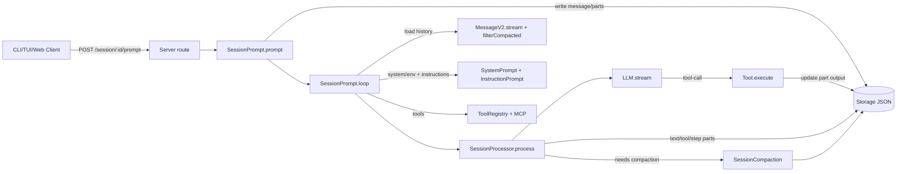
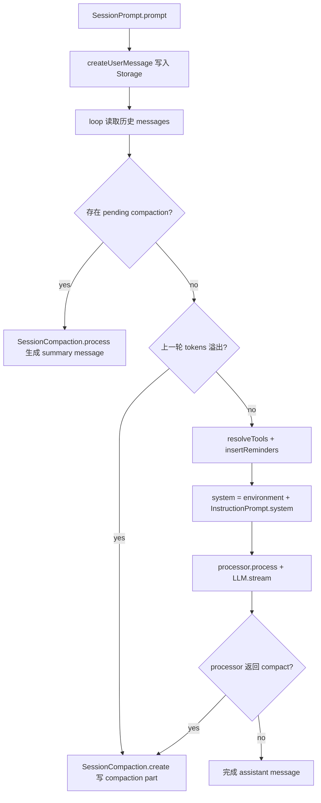

toolName: todo_write
            
status: success
          
Todos updated: 5 items
          

        
            
toolName: view_folder
            
status: success
          
d:\github_repo\opencode
          

        
            
toolName: search_codebase
            
status: success
          
query: coding agent context assembly and prompt building flow (system prompt, tools, conversation messages, context window management) in packages/opencode/src
          

        
            
toolName: search_codebase
            
status: success
          
query: memory storage implementation (short-term vs long-term), summaries, compaction, persistence for sessions/messages in packages/opencode/src
          

        
            
toolName: view_files
            
status: success
          
            
filePath: d:\github_repo\opencode\packages\opencode\src\index.ts
          

        
            
toolName: search_by_regex
            
status: success
          
query: export namespace SessionPrompt|function insertReminders|insertReminders\(|prompt\s*\(
          

        
            
toolName: view_files
            
status: success
          
            
filePath: d:\github_repo\opencode\packages\opencode\src\session\prompt.ts
          

        
            
toolName: view_files
            
status: success
          
            
filePath: d:\github_repo\opencode\packages\opencode\src\session\prompt.ts
          

        
            
toolName: search_by_regex
            
status: success
          
query: function resolveTools|async function resolveTools|function createUserMessage|async function createUserMessage|InstructionPrompt\.system|SystemPrompt\.environment
          

        
            
toolName: view_files
            
status: success
          
            
filePath: d:\github_repo\opencode\packages\opencode\src\session\prompt.ts
          

        
            
toolName: view_files
            
status: success
          
            
filePath: d:\github_repo\opencode\packages\opencode\src\session\prompt.ts
          

        
            
toolName: search_codebase
            
status: success
          
query: InstructionPrompt implementation: where system instructions are loaded, how project/user memory files are read and injected into system prompt
          

        
            
toolName: view_files
            
status: success
          
            
filePath: d:\github_repo\opencode\packages\opencode\src\session\instruction.ts
          

        
            
toolName: view_files
            
status: success
          
            
filePath: d:\github_repo\opencode\packages\opencode\src\session\system.ts
          

        
            
toolName: search_by_regex
            
status: success
          
query: SessionPrompt\.prompt\(|/prompt"|prompt\s*session
          

        
            
toolName: view_files
            
status: success
          
            
filePath: d:\github_repo\opencode\packages\opencode\src\server\routes\session.ts
          

        
            
toolName: view_files
            
status: success
          
            
filePath: d:\github_repo\opencode\packages\opencode\src\session\index.ts
          

        
            
toolName: view_files
            
status: success
          
            
filePath: d:\github_repo\opencode\packages\opencode\src\session\message-v2.ts
          

        
            
toolName: search_by_regex
            
status: success
          
query: toModelMessages\(|filterCompacted\(|stream\(|updatePart\(|read<|Storage\.write\(|convertToModelMessages
          

        
            
toolName: view_files
            
status: success
          
            
filePath: d:\github_repo\opencode\packages\opencode\src\session\message-v2.ts
          

        
            
toolName: search_by_regex
            
status: success
          
query: isOverflow|create\(|process\(|prune\(|compacting|SessionCompaction
          

        
            
toolName: view_files
            
status: success
          
            
filePath: d:\github_repo\opencode\packages\opencode\src\session\compaction.ts
          

        
            
toolName: view_files
            
status: success
          
            
filePath: d:\github_repo\opencode\packages\opencode\src\session\summary.ts
          

        
            
toolName: view_files
            
status: success
          
            
filePath: d:\github_repo\opencode\packages\opencode\src\storage\storage.ts
          

        
            
toolName: search_codebase
            
status: success
          
query: where InstructionPrompt.resolve(...) is called (likely in read tool or file tools) to auto-load AGENTS.md/CLAUDE.md near read files
          

        
            
toolName: search_by_regex
            
status: success
          
query: InstructionPrompt\.resolve\(
          

        
            
toolName: view_files
            
status: success
          
            
filePath: d:\github_repo\opencode\packages\opencode\src\tool\read.ts
          

        
            
toolName: view_files
            
status: success
          
            
filePath: d:\github_repo\opencode\packages\opencode\src\tool\truncation.ts
          

        
            
toolName: view_files
            
status: success
          
            
filePath: d:\github_repo\opencode\packages\opencode\src\session\processor.ts
          

        
            
toolName: view_files
            
status: success
          
            
filePath: d:\github_repo\opencode\packages\opencode\src\session\processor.ts
          

        
            
toolName: view_files
            
status: success
          
            
filePath: d:\github_repo\opencode\packages\opencode\src\agent\agent.ts
          

        
            
toolName: search_codebase
            
status: success
          
query: vector embedding memory, semantic search storage, long-term memory database (embedding, vector, pinecone, chroma, sqlite) in packages/opencode/src
          

        
            
toolName: search_by_regex
            
status: success
          
query: embedding|vector_store|chroma|pinecone|faiss|milvus
          

        
            
toolName: search_by_regex
            
status: success
          
query: compaction\s*:\s*z\.|compaction\s*\?|reserved|continue_loop_on_deny
          

        
            
toolName: view_files
            
status: success
          
            
filePath: d:\github_repo\opencode\packages\opencode\src\config\config.ts
          

        
            
toolName: search_by_regex
            
status: success
          
query: OPENCODE_EXPERIMENTAL_PLAN_MODE|OPENCODE_DISABLE_PROJECT_CONFIG|OPENCODE_DISABLE_CLAUDE_CODE_PROMPT|OPENCODE_CONFIG_DIR
          

        
            
toolName: view_files
            
status: success
          
            
filePath: d:\github_repo\opencode\packages\opencode\src\flag\flag.ts
          

        
            
toolName: todo_write
            
status: failed
          
Todos updated: 0 items
          

        
            
toolName: todo_write
            
status: success
          
Todos updated: 5 items
          

        
            
toolName: search_by_regex
            
status: success
          
query: export const messages|messages\s*=\s*fn\(|async function messages\(|export async function messages
          

        
            
toolName: view_files
            
status: success
          
            
filePath: d:\github_repo\opencode\packages\opencode\src\session\index.ts
          

        
            
toolName: todo_write
            
status: success
          
Todos updated: 5 items
          

        
            
toolName: todo_write
            
status: success
          
Todos updated: 5 items
          
**目标与范围**
- 目标：系统性读懂 opencode 的 *coding agent* 在一次用户交互中如何“收集→组织→更新→检索”上下文，以及“短期/长期记忆（含压缩与持久化）”如何实现与流转。
- 范围（本次基于代码现状）：会话级记忆主要由 **Session 消息/部件持久化 + 上下文裁剪/压缩(compaction/prune) + 指令文件自动注入(InstructionPrompt)** 组成；未看到独立的向量数据库式“长期记忆”，仅在某些 provider 的 *file search* 工具里出现 vector store 参数（外部检索能力，不等同于 agent 内置记忆）。见 [openai-responses-prepare-tools.ts](file:///d:/github_repo/opencode/packages/opencode/src/provider/sdk/copilot/responses/openai-responses-prepare-tools.ts)。

---

## 1) 项目结构梳理：定位上下文/记忆核心模块（建议先读）
**核心链路（强相关）**
- 会话入口与主循环（上下文拼装、工具集、compaction 触发）：[prompt.ts:L62-L711](file:///d:/github_repo/opencode/packages/opencode/src/session/prompt.ts#L62-L711)
- 消息/部件模型与“发给模型的上下文”转换（短期记忆的组织形式）：[message-v2.ts:L15-L751](file:///d:/github_repo/opencode/packages/opencode/src/session/message-v2.ts#L15-L751)
- LLM 流式处理与工具调用记录（上下文的动态更新点）：[processor.ts:L26-L409](file:///d:/github_repo/opencode/packages/opencode/src/session/processor.ts#L26-L409)
- 上下文溢出检测、对话压缩、工具输出裁剪（记忆压缩策略）：[compaction.ts:L32-L229](file:///d:/github_repo/opencode/packages/opencode/src/session/compaction.ts#L32-L229)
- 会话摘要/差异（与“记忆内容”相关的派生信息）：[summary.ts:L77-L203](file:///d:/github_repo/opencode/packages/opencode/src/session/summary.ts#L77-L203)
- 存储层（长期持久化载体）：[storage.ts:L169-L227](file:///d:/github_repo/opencode/packages/opencode/src/storage/storage.ts#L169-L227)

**“指令/记忆”注入机制（很关键，常被忽略）**
- 指令文件收集与注入：项目/全局 AGENTS.md、CLAUDE.md、config.instructions（本质是可持久的“外部记忆/偏好”）：[instruction.ts:L13-L145](file:///d:/github_repo/opencode/packages/opencode/src/session/instruction.ts#L13-L145)
- Read 工具在读文件时把这些指令包进 `<system-reminder>` 注入到上下文：[read.ts:L111-L203](file:///d:/github_repo/opencode/packages/opencode/src/tool/read.ts#L111-L203)

**配置与开关（决定上下文/记忆策略）**
- compaction auto/prune/reserved 与 instructions 等： [config.ts:L1151-L1192](file:///d:/github_repo/opencode/packages/opencode/src/config/config.ts#L1151-L1192)
- 环境变量 flag（例如实验 plan mode、禁用项目指令等）：[flag.ts:L6-L96](file:///d:/github_repo/opencode/packages/opencode/src/flag/flag.ts#L6-L96)
- agent 默认权限与内置 agent（build/plan/compaction/title/summary）：[agent.ts:L51-L202](file:///d:/github_repo/opencode/packages/opencode/src/agent/agent.ts#L51-L202)

---

## 2) 建立代码阅读优先级：从入口点追踪上下文初始化与记忆读写（推荐阅读顺序）
下面顺序保证你每一步都能把“调用链 + 数据结构 + 存储落点”对上号：

1. **入口与路由**
   - CLI 总入口： [index.ts:L42-L100](file:///d:/github_repo/opencode/packages/opencode/src/index.ts#L42-L100)
   - 服务端会话 prompt 接口： [session.ts:L700-L767](file:///d:/github_repo/opencode/packages/opencode/src/server/routes/session.ts#L700-L767)

2. **会话 prompt 主流程（上下文初始化点）**
   - `SessionPrompt.prompt()`：创建 user message、处理权限兼容、进入 loop： [prompt.ts:L158-L187](file:///d:/github_repo/opencode/packages/opencode/src/session/prompt.ts#L158-L187)
   - `createUserMessage()`：把用户输入 parts 写入 Storage，并对 file/agent part 做“上下文增强”（尤其 file→Read 注入）：[prompt.ts:L944-L1325](file:///d:/github_repo/opencode/packages/opencode/src/session/prompt.ts#L944-L1325)

3. **loop：上下文检索 + 组织 + 更新**
   - 取历史消息：`MessageV2.stream()` + `filterCompacted()`： [prompt.ts:L300-L305](file:///d:/github_repo/opencode/packages/opencode/src/session/prompt.ts#L300-L305) 与 [message-v2.ts:L703-L751](file:///d:/github_repo/opencode/packages/opencode/src/session/message-v2.ts#L703-L751)
   - compaction 分支与 overflow 检测： [prompt.ts:L524-L550](file:///d:/github_repo/opencode/packages/opencode/src/session/prompt.ts#L524-L550)
   - 系统提示组装（environment + instructions）：[prompt.ts:L648-L654](file:///d:/github_repo/opencode/packages/opencode/src/session/prompt.ts#L648-L654) 与 [system.ts:L29-L53](file:///d:/github_repo/opencode/packages/opencode/src/session/system.ts#L29-L53) 、[instruction.ts:L118-L145](file:///d:/github_repo/opencode/packages/opencode/src/session/instruction.ts#L118-L145)
   - 工具集解析（ToolRegistry + MCP + 权限 ask）：[prompt.ts:L731-L912](file:///d:/github_repo/opencode/packages/opencode/src/session/prompt.ts#L731-L912)

4. **LLM 流式执行与工具调用（上下文更新点）**
   - `SessionProcessor.process()`：文本 delta、tool call、tool result、step-start/finish、needsCompaction： [processor.ts:L45-L276](file:///d:/github_repo/opencode/packages/opencode/src/session/processor.ts#L45-L276)

5. **记忆持久化与压缩策略**
   - Storage：read/write/list： [storage.ts:L169-L227](file:///d:/github_repo/opencode/packages/opencode/src/storage/storage.ts#L169-L227)
   - Session.messages() / updateMessage() / updatePart()（写入落点）：[index.ts:L318-L384](file:///d:/github_repo/opencode/packages/opencode/src/session/index.ts#L318-L384)
   - compaction：isOverflow / prune / process： [compaction.ts:L32-L229](file:///d:/github_repo/opencode/packages/opencode/src/session/compaction.ts#L32-L229)

---

## 3) 上下文机制分析：收集、组织、更新、检索
### 3.1 收集（collect）
**来源 1：用户显式输入**
- 用户输入以 `PromptInput.parts` 的形式进入 `SessionPrompt.prompt()`；随后 `createUserMessage()` 将其写入消息与 part 存储。见 [prompt.ts:L91-L187](file:///d:/github_repo/opencode/packages/opencode/src/session/prompt.ts#L91-L187)、[prompt.ts:L954-L1324](file:///d:/github_repo/opencode/packages/opencode/src/session/prompt.ts#L954-L1324)

**来源 2：文件/目录/资源等“上下文附件”**
- 当 user part 是 `file:` URL 且 `mime=text/plain`，会在 `createUserMessage()` 中**合成一段“Called the Read tool…” + 实际 read 输出**作为 synthetic text parts，从而把文件内容直接注入会话上下文（而不只是传一个文件引用）。见 [prompt.ts:L1088-L1197](file:///d:/github_repo/opencode/packages/opencode/src/session/prompt.ts#L1088-L1197)
- MCP resource 也会在这里被读取并转成 text parts/attachments 注入： [prompt.ts:L974-L1044](file:///d:/github_repo/opencode/packages/opencode/src/session/prompt.ts#L974-L1044)

**来源 3：指令/规则文件（“外部记忆”）**
- Read 工具执行时调用 `InstructionPrompt.resolve()`，向上搜索相邻目录的 `AGENTS.md/CLAUDE.md`，并把内容包进 `<system-reminder>` 附加到 read 输出： [read.ts:L111-L203](file:///d:/github_repo/opencode/packages/opencode/src/tool/read.ts#L111-L203) + [instruction.ts:L164-L196](file:///d:/github_repo/opencode/packages/opencode/src/session/instruction.ts#L164-L196)
- 全局/配置的 instructions（文件路径、glob、URL）会进入 system prompt（`InstructionPrompt.system()`）：[instruction.ts:L71-L145](file:///d:/github_repo/opencode/packages/opencode/src/session/instruction.ts#L71-L145) 与 [config.ts:L1151-L1154](file:///d:/github_repo/opencode/packages/opencode/src/config/config.ts#L1151-L1154)

### 3.2 组织（organize）
**内部表示：Message + Part**
- `MessageV2` 用 `Info`（role、model、agent、finish、tokens…）+ `Part`（text/tool/file/step…）表达一次对话轮次的所有结构化信息。见 [message-v2.ts:L72-L255](file:///d:/github_repo/opencode/packages/opencode/src/session/message-v2.ts#L72-L255)

**给模型的上下文表示：toModelMessages**
- `MessageV2.toModelMessages()` 把 WithParts 转成 `ai` SDK 的 `ModelMessage[]`，并：
  - 把 tool result 封装为 `tool-*` 块
  - 对不支持 media-in-tool-result 的 provider，把图片/PDF 从 tool result 抽出，额外注入一条 user message（保证模型能看到媒体）  
  见 [message-v2.ts:L478-L688](file:///d:/github_repo/opencode/packages/opencode/src/session/message-v2.ts#L478-L688)

### 3.3 更新（update）
**更新点 1：LLM 流式输出**
- `text-delta` / `reasoning-delta` 会不断 `Session.updatePart({part, delta})` 写入存储与事件总线（可供 UI 实时刷新）。见 [processor.ts:L79-L100](file:///d:/github_repo/opencode/packages/opencode/src/session/processor.ts#L79-L100)、[processor.ts:L279-L326](file:///d:/github_repo/opencode/packages/opencode/src/session/processor.ts#L279-L326)

**更新点 2：工具调用生命周期**
- tool-input-start → tool-call(running) → tool-result(completed)/tool-error(error)，每一步都落为 `MessageV2.ToolPart` 状态机。见 [processor.ts:L103-L221](file:///d:/github_repo/opencode/packages/opencode/src/session/processor.ts#L103-L221)

**更新点 3：会话摘要与 diff**
- 每个 step finish 后会触发 `SessionSummary.summarize()`（异步计算 diff、title 等）。见 [processor.ts:L270-L276](file:///d:/github_repo/opencode/packages/opencode/src/session/processor.ts#L270-L276) 与 [summary.ts:L77-L153](file:///d:/github_repo/opencode/packages/opencode/src/session/summary.ts#L77-L153)

### 3.4 检索（retrieve）
**检索点 1：构建 prompt 前取历史消息**
- `MessageV2.stream(sessionID)` 从 Storage.list(message) 反向遍历消息并 yield： [message-v2.ts:L703-L711](file:///d:/github_repo/opencode/packages/opencode/src/session/message-v2.ts#L703-L711)
- `filterCompacted()` 会把上下文截断到最近一次 compaction 边界（避免无限增长）：[message-v2.ts:L736-L751](file:///d:/github_repo/opencode/packages/opencode/src/session/message-v2.ts#L736-L751)

**检索点 2：系统提示**
- `SystemPrompt.environment()` 生成环境块；再拼 `InstructionPrompt.system()` 的内容： [prompt.ts:L648-L654](file:///d:/github_repo/opencode/packages/opencode/src/session/prompt.ts#L648-L654)

---

## 4) 记忆系统架构：短期记忆 vs 长期记忆（以当前实现为准）
### 4.1 短期记忆（Short-term）
- **载体**：当前 session 的 MessageV2 历史（text、tool output、file attachments、step markers…），每轮 prompt 由 `toModelMessages()` 转换成模型上下文。见 [message-v2.ts:L478-L701](file:///d:/github_repo/opencode/packages/opencode/src/session/message-v2.ts#L478-L701)
- **容量控制**：
  - 工具输出截断并落盘到 `Global.Path.data/tool-output`，在上下文里只保留预览 + 指引： [truncation.ts:L50-L105](file:///d:/github_repo/opencode/packages/opencode/src/tool/truncation.ts#L50-L105)
  - `SessionCompaction.isOverflow()` 基于 token 估算与 reserved buffer 判断是否溢出： [compaction.ts:L32-L48](file:///d:/github_repo/opencode/packages/opencode/src/session/compaction.ts#L32-L48)

### 4.2 长期记忆（Long-term）
这里分两层理解更贴近代码现实：

**(A) 会话内长期记忆（Session-level long-term）**
- **Compaction 生成的 summary assistant message**：当上下文满时，创建 compaction user part，然后用 compaction agent 生成“续聊摘要/继续提示”，并作为 `summary: true` 的 assistant message 存入历史。见：
  - 触发与创建： [prompt.ts:L537-L550](file:///d:/github_repo/opencode/packages/opencode/src/session/prompt.ts#L537-L550) + [compaction.ts:L231-L259](file:///d:/github_repo/opencode/packages/opencode/src/session/compaction.ts#L231-L259)
  - 生成过程： [compaction.ts:L101-L229](file:///d:/github_repo/opencode/packages/opencode/src/session/compaction.ts#L101-L229)
- **Prune 旧 tool output**：当累计 tool 输出过大时，把旧 tool part 标记 `time.compacted`，模型侧看到占位文本 `[Old tool result content cleared]`。见 [compaction.ts:L58-L99](file:///d:/github_repo/opencode/packages/opencode/src/session/compaction.ts#L58-L99) 与 [message-v2.ts:L607-L609](file:///d:/github_repo/opencode/packages/opencode/src/session/message-v2.ts#L607-L609)

**(B) 跨会话的“持久记忆/偏好”**
- **指令文件机制**承担了“可持久、可版本化”的偏好/规则存储：项目/全局 `AGENTS.md`、`~/.claude/CLAUDE.md`、以及 `config.instructions` 指向的文件/URL。见 [instruction.ts:L19-L145](file:///d:/github_repo/opencode/packages/opencode/src/session/instruction.ts#L19-L145)
- 这些内容通过两条路径进入上下文：
  - system prompt 全量注入：`InstructionPrompt.system()`（更像全局规则）[instruction.ts:L118-L145](file:///d:/github_repo/opencode/packages/opencode/src/session/instruction.ts#L118-L145)
  - 读文件时按目录就近注入：`InstructionPrompt.resolve()` + ReadTool 附加 `<system-reminder>`（更像“与当前文件相关的局部记忆”）[read.ts:L111-L203](file:///d:/github_repo/opencode/packages/opencode/src/tool/read.ts#L111-L203)

---

## 5) 用户交互时：上下文与记忆数据的端到端流转路径（含关键调用链）
### 5.1 总体架构图（模块视角）

- 路由到 prompt： [session.ts:L700-L767](file:///d:/github_repo/opencode/packages/opencode/src/server/routes/session.ts#L700-L767)
- prompt→loop： [prompt.ts:L158-L187](file:///d:/github_repo/opencode/packages/opencode/src/session/prompt.ts#L158-L187)
- loop 取历史 + 转模型消息： [prompt.ts:L300-L305](file:///d:/github_repo/opencode/packages/opencode/src/session/prompt.ts#L300-L305) + [message-v2.ts:L478-L751](file:///d:/github_repo/opencode/packages/opencode/src/session/message-v2.ts#L478-L751)
- processor 落盘： [processor.ts:L103-L221](file:///d:/github_repo/opencode/packages/opencode/src/session/processor.ts#L103-L221)

### 5.2 关键调用链（建议你在阅读时“逐行标注”）
**主链路（一次 prompt）**
1. `POST /:sessionID/prompt` → `SessionPrompt.prompt()`：[session.ts:L700-L735](file:///d:/github_repo/opencode/packages/opencode/src/server/routes/session.ts#L700-L735)
2. `createUserMessage()` 写入 user message + parts（可能包含 file→Read 的 synthetic 注入）：[prompt.ts:L944-L1325](file:///d:/github_repo/opencode/packages/opencode/src/session/prompt.ts#L944-L1325)
3. `loop()`：
   - `MessageV2.stream()` 读历史 + `filterCompacted()` 截断：[prompt.ts:L300-L305](file:///d:/github_repo/opencode/packages/opencode/src/session/prompt.ts#L300-L305) + [message-v2.ts:L703-L751](file:///d:/github_repo/opencode/packages/opencode/src/session/message-v2.ts#L703-L751)
   - `resolveTools()` 构建工具集与 tool 上下文（含 permission ask + plugin hooks）：[prompt.ts:L731-L912](file:///d:/github_repo/opencode/packages/opencode/src/session/prompt.ts#L731-L912)
   - `system = environment + instructions`：[prompt.ts:L648-L654](file:///d:/github_repo/opencode/packages/opencode/src/session/prompt.ts#L648-L654)
   - `processor.process({messages: toModelMessages(...)})`：[prompt.ts:L655-L675](file:///d:/github_repo/opencode/packages/opencode/src/session/prompt.ts#L655-L675)
4. `SessionProcessor.process()`：
   - 记录 tool call / tool result、text delta、step markers： [processor.ts:L103-L276](file:///d:/github_repo/opencode/packages/opencode/src/session/processor.ts#L103-L276)
   - 若溢出，返回 `"compact"`： [processor.ts:L274-L276](file:///d:/github_repo/opencode/packages/opencode/src/session/processor.ts#L274-L276) 与 [processor.ts:L401-L404](file:///d:/github_repo/opencode/packages/opencode/src/session/processor.ts#L401-L404)
5. compaction：
   - loop 收到 `"compact"` 会创建 compaction 请求 part： [prompt.ts:L701-L709](file:///d:/github_repo/opencode/packages/opencode/src/session/prompt.ts#L701-L709) + [compaction.ts:L231-L259](file:///d:/github_repo/opencode/packages/opencode/src/session/compaction.ts#L231-L259)
   - 下轮 loop 识别到 `task?.type === "compaction"`，执行 `SessionCompaction.process()`： [prompt.ts:L524-L535](file:///d:/github_repo/opencode/packages/opencode/src/session/prompt.ts#L524-L535)

---

## 6) 关键设计模式与最佳实践（可沉淀到技术文档）
- **“消息即事件源（event-sourced-ish）”**：把对话、工具、快照、patch 都落为 Message/Part；UI/服务只需要重放即可重建上下文。参见 `Session.updateMessage/updatePart`： [index.ts:L378-L418](file:///d:/github_repo/opencode/packages/opencode/src/session/index.ts#L378-L418)
- **“上下文裁剪两段式：prune（丢细节）→ compaction（做摘要）”**：先把旧 tool 输出清掉，再在 token 逼近时用 compaction agent 生成可续聊摘要。见 [compaction.ts:L58-L99](file:///d:/github_repo/opencode/packages/opencode/src/session/compaction.ts#L58-L99) 与 [compaction.ts:L101-L229](file:///d:/github_repo/opencode/packages/opencode/src/session/compaction.ts#L101-L229)
- **“就近规则注入（InstructionPrompt.resolve）”**：读文件时自动注入同目录/上层的 AGENTS.md/CLAUDE.md，保证上下文与正在看的代码强相关。见 [read.ts:L111-L203](file:///d:/github_repo/opencode/packages/opencode/src/tool/read.ts#L111-L203)
- **“工具上下文统一封装 + 插件钩子”**：tool 执行前后统一触发 plugin hook、统一 permission ask，便于审计/扩展。见 [prompt.ts:L744-L812](file:///d:/github_repo/opencode/packages/opencode/src/session/prompt.ts#L744-L812)
- **“模型适配层”**：`toModelMessages()` 针对不同 provider 的媒体/工具结果限制做兼容注入。见 [message-v2.ts:L490-L688](file:///d:/github_repo/opencode/packages/opencode/src/session/message-v2.ts#L490-L688)

---

## 7) 输出完整分析报告（含流程图 + 核心代码片段解释）
### 7.1 Prompt 处理流程图（细化）

- prompt/loop/compaction 分支： [prompt.ts:L158-L711](file:///d:/github_repo/opencode/packages/opencode/src/session/prompt.ts#L158-L711)
- processor “compact” 信号： [processor.ts:L274-L276](file:///d:/github_repo/opencode/packages/opencode/src/session/processor.ts#L274-L276)

### 7.2 核心代码片段解读（围绕上下文与记忆）
**(1) system prompt 的组成 = 环境信息 + 指令文件**
- 组装位置：`const system = [...SystemPrompt.environment, ...InstructionPrompt.system()]`：[prompt.ts:L648-L654](file:///d:/github_repo/opencode/packages/opencode/src/session/prompt.ts#L648-L654)
- 环境块内容： [system.ts:L29-L53](file:///d:/github_repo/opencode/packages/opencode/src/session/system.ts#L29-L53)
- 指令来源：全局/项目/URL/配置： [instruction.ts:L71-L145](file:///d:/github_repo/opencode/packages/opencode/src/session/instruction.ts#L71-L145)

**(2) “读文件即扩上下文”：ReadTool 注入 `<system-reminder>`**
- `InstructionPrompt.resolve()` 找就近指令并返回 `{filepath, content}` 列表： [instruction.ts:L171-L196](file:///d:/github_repo/opencode/packages/opencode/src/session/instruction.ts#L171-L196)
- ReadTool 把指令拼进输出： [read.ts:L190-L192](file:///d:/github_repo/opencode/packages/opencode/src/tool/read.ts#L190-L192)

**(3) compaction 的“长期记忆化”方式：生成 summary assistant message**
- overflow 判断（含 reserved buffer）： [compaction.ts:L32-L48](file:///d:/github_repo/opencode/packages/opencode/src/session/compaction.ts#L32-L48)
- 生成摘要 prompt + 调用 processor： [compaction.ts:L145-L200](file:///d:/github_repo/opencode/packages/opencode/src/session/compaction.ts#L145-L200)

---

# 你可以直接照着执行的“系统性阅读与记录模板”（建议照抄到你自己的笔记里）
- **调用链表**：每读到一个关键函数，记录 `caller → callee → 存储读写点 → 关键入参/出参 → 事件/副作用`
  - 例如：`SessionPrompt.loop → SessionProcessor.process → Session.updatePart`（见 [prompt.ts:L562-L675](file:///d:/github_repo/opencode/packages/opencode/src/session/prompt.ts#L562-L675)、[processor.ts:L103-L221](file:///d:/github_repo/opencode/packages/opencode/src/session/processor.ts#L103-L221)、[index.ts:L418-L418](file:///d:/github_repo/opencode/packages/opencode/src/session/index.ts#L418-L418)）
- **数据结构卡片**：Session.Info、MessageV2.Info、MessageV2.Part（tool part state）分别记字段含义与写入位置
  - Session.Info： [index.ts:L54-L95](file:///d:/github_repo/opencode/packages/opencode/src/session/index.ts#L54-L95)
  - MessageV2.Part（tool state）：从 [message-v2.ts:L72-L260](file:///d:/github_repo/opencode/packages/opencode/src/session/message-v2.ts#L72-L260) 开始向下扩读
- **配置参数清单**：`config.compaction.*`、`config.instructions`、flags
  - [config.ts:L1151-L1192](file:///d:/github_repo/opencode/packages/opencode/src/config/config.ts#L1151-L1192)
  - [flag.ts:L6-L96](file:///d:/github_repo/opencode/packages/opencode/src/flag/flag.ts#L6-L96)

如果你希望我把这份报告进一步“落成一份可维护的技术文档（含更完整的调用链表格、关键数据结构字段释义、以及把 mermaid 图拆成多张更细的子图）”，我可以在不新增任何仓库文档文件的前提下继续在对话里输出分章节版本，并补齐你关心的 UI（TUI/Web）侧如何消费这些 message/part 事件流的细节（起点可从 [session/index.tsx](file:///d:/github_repo/opencode/packages/opencode/src/cli/cmd/tui/routes/session/index.tsx) 追到 SDK 事件订阅与渲染）。