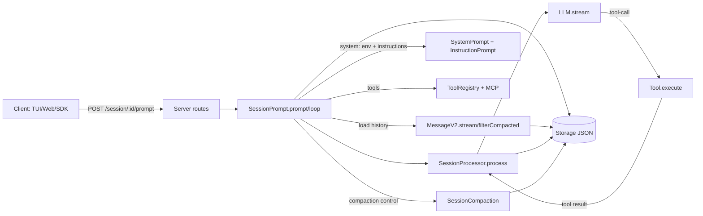

# OpenCode Coding Agent：上下文与记忆机制（可维护技术文档）

> 面向：需要深入理解 opencode（packages/opencode）中 coding agent 的上下文处理与“记忆（含压缩）”实现的研发/维护者  
> 范围：以当前仓库代码为准（Windows 路径）。本文件聚焦 **会话内上下文**、**持久化会话记忆**、**压缩/裁剪策略**、**指令注入** 与 **关键调用链/数据结构**。

---

## 目录

- [1. 术语与核心结论](#1-术语与核心结论)
- [2. 总览架构（拆分图）](#2-总览架构拆分图)
- [3. 调用链总表（可维护）](#3-调用链总表可维护)
- [4. 上下文收集/组织/更新/检索机制](#4-上下文收集组织更新检索机制)
- [5. 记忆系统与压缩机制（重点）](#5-记忆系统与压缩机制重点)
- [6. 关键数据结构字段释义](#6-关键数据结构字段释义)
- [7. 配置参数与开关清单](#7-配置参数与开关清单)
- [8. 维护指南与扩展点（最佳实践）](#8-维护指南与扩展点最佳实践)

---

## 1. 术语与核心结论

### 1.1 术语

- **上下文（Context）**：每次调用模型时发送给 LLM 的 `system[] + messages[] + tools` 的组合。
- **短期记忆（Short-term memory）**：会话中最近的 Message/Part 历史在一次 prompt 构建中被转换成 LLM 消息序列（窗口受 token 限制）。
- **长期记忆（Long-term memory）**：在本仓库实现里主要体现在：
  1. **会话持久化**：Message/Part/Session 存入本地 Storage（JSON 文件）；跨进程/重启可恢复（会话级长期）。
  2. **规则/偏好注入**：`AGENTS.md`、`CLAUDE.md`、`config.instructions` 等“指令文件”作为可持久化偏好/约束，注入到 system prompt 或 read 输出（跨会话持久化偏好）。
- **记忆压缩（Memory compression）**：在上下文满时，通过 compaction 生成摘要消息；以及通过 prune 清理旧 tool 输出，避免上下文爆炸。

### 1.2 核心结论（维护者视角）

- **上下文入口**：HTTP 路由 `POST /session/:id/prompt` 调用 `SessionPrompt.prompt()`，进入 session loop 构建上下文并驱动 LLM 流式执行。  
  代码： [session.ts:L700-L767](file:///d:/github_repo/opencode/packages/opencode/src/server/routes/session.ts#L700-L767)，[prompt.ts:L158-L187](file:///d:/github_repo/opencode/packages/opencode/src/session/prompt.ts#L158-L187)
- **上下文组织单元**：`MessageV2.Info + MessageV2.Part[]` 是会话的“事件流”，`MessageV2.toModelMessages()` 将其转成真正送进 LLM 的消息序列。  
  代码： [message-v2.ts:L472-L701](file:///d:/github_repo/opencode/packages/opencode/src/session/message-v2.ts#L472-L701)
- **记忆压缩双策略**：
  - **Prune**：先把“旧的、超预算的 tool 输出”标记为 compacted（仅保留占位文本），降低 token 成本。  
    代码： [compaction.ts:L58-L99](file:///d:/github_repo/opencode/packages/opencode/src/session/compaction.ts#L58-L99)，占位渲染： [message-v2.ts:L607-L609](file:///d:/github_repo/opencode/packages/opencode/src/session/message-v2.ts#L607-L609)
  - **Compaction**：当 token 达到可用上限时，创建 compaction 任务并生成“可继续对话的摘要提示”，作为 `summary: true` 的 assistant message 存入会话。  
    代码： [prompt.ts:L537-L550](file:///d:/github_repo/opencode/packages/opencode/src/session/prompt.ts#L537-L550)，[compaction.ts:L101-L229](file:///d:/github_repo/opencode/packages/opencode/src/session/compaction.ts#L101-L229)
- **指令注入是“隐式上下文来源”**：Read 工具读取文件时，会自动向上查找并注入目录相关的 `AGENTS.md/CLAUDE.md`，以 `<system-reminder>` 形式进入上下文。  
  代码： [read.ts:L111-L203](file:///d:/github_repo/opencode/packages/opencode/src/tool/read.ts#L111-L203)，[instruction.ts:L171-L196](file:///d:/github_repo/opencode/packages/opencode/src/session/instruction.ts#L171-L196)

---

## 2. 总览架构（拆分图）

### 2.1 组件关系图（模块视角）



关键点代码：
- 路由到 prompt： [session.ts:L700-L767](file:///d:/github_repo/opencode/packages/opencode/src/server/routes/session.ts#L700-L767)
- prompt/loop： [prompt.ts:L158-L711](file:///d:/github_repo/opencode/packages/opencode/src/session/prompt.ts#L158-L711)
- 存储 API： [storage.ts:L169-L227](file:///d:/github_repo/opencode/packages/opencode/src/storage/storage.ts#L169-L227)

### 2.2 单次交互流程图（prompt loop）

```mermaid
flowchart TD
  A[SessionPrompt.prompt] --> B[createUserMessage 写入 user message + parts]
  B --> C[loop 读取历史 messages]
  C --> D{有 pending compaction?}
  D -->|是| E[SessionCompaction.process 生成 summary assistant]
  D -->|否| F{上一轮 tokens 溢出?}
  F -->|是| G[SessionCompaction.create 写 compaction user part]
  F -->|否| H[resolveTools + insertReminders]
  H --> I[system = environment + InstructionPrompt.system]
  I --> J[messages = MessageV2.toModelMessages]
  J --> K[SessionProcessor.process(LMM.stream)]
  K --> L{结果=compact?}
  L -->|是| G
  L -->|否| M[结束/继续下一步]
```

关键点代码：
- 创建 user message： [prompt.ts:L944-L1325](file:///d:/github_repo/opencode/packages/opencode/src/session/prompt.ts#L944-L1325)
- overflow 检测与 compaction 触发： [prompt.ts:L537-L550](file:///d:/github_repo/opencode/packages/opencode/src/session/prompt.ts#L537-L550)
- 构建 system： [prompt.ts:L648-L654](file:///d:/github_repo/opencode/packages/opencode/src/session/prompt.ts#L648-L654)
- `toModelMessages`： [message-v2.ts:L478-L701](file:///d:/github_repo/opencode/packages/opencode/src/session/message-v2.ts#L478-L701)

### 2.3 指令注入流程图（InstructionPrompt + ReadTool）

```mermaid
flowchart TD
  R[ReadTool.execute(file)] --> A[InstructionPrompt.resolve(messages, filepath, messageID)]
  A --> B[向上目录查找 AGENTS.md/CLAUDE.md]
  B --> C[过滤：系统指令/已加载/已 claim]
  C --> D[读取内容并返回 {filepath, content}]
  D --> E[ReadTool 输出追加 <system-reminder>...]
  E --> F[tool-result 写入 ToolPart.output]
  F --> G[MessageV2.toModelMessages 将其送入上下文]
```

关键点代码：
- 查找与过滤： [instruction.ts:L171-L196](file:///d:/github_repo/opencode/packages/opencode/src/session/instruction.ts#L171-L196)
- ReadTool 追加 reminder： [read.ts:L190-L192](file:///d:/github_repo/opencode/packages/opencode/src/tool/read.ts#L190-L192)

---

## 3. 调用链总表（可维护）

> 维护建议：当你新增“Part 类型 / 工具 / 压缩策略”时，优先更新本表对应行（入口、写入点、读出点、上下文影响）。

| 场景 | 起点函数 | 关键子调用 | 持久化写入点 | 对上下文的直接影响 |
|---|---|---|---|---|
| 发送消息（同步） | `POST /session/:id/prompt` [session.ts:L700-L737](file:///d:/github_repo/opencode/packages/opencode/src/server/routes/session.ts#L700-L737) | `SessionPrompt.prompt()` [prompt.ts:L158-L187](file:///d:/github_repo/opencode/packages/opencode/src/session/prompt.ts#L158-L187) | `Session.updateMessage/updatePart` [index.ts:L378-L418](file:///d:/github_repo/opencode/packages/opencode/src/session/index.ts#L378-L418) | 创建本轮 user message，驱动 loop 构建上下文 |
| 创建 user message | `createUserMessage()` [prompt.ts:L944-L1325](file:///d:/github_repo/opencode/packages/opencode/src/session/prompt.ts#L944-L1325) | file part → ReadTool（合成文本）、agent part → subtask hint | `Session.updateMessage` / `Session.updatePart` 同上 | 把用户输入与合成上下文（读文件结果等）写入会话 |
| 读取历史消息 | `MessageV2.stream()` [message-v2.ts:L703-L711](file:///d:/github_repo/opencode/packages/opencode/src/session/message-v2.ts#L703-L711) | `Storage.list/read` [storage.ts:L169-L227](file:///d:/github_repo/opencode/packages/opencode/src/storage/storage.ts#L169-L227) | 无（读） | 形成 prompt 的“短期记忆输入集” |
| 截断到 compaction 边界 | `MessageV2.filterCompacted()` [message-v2.ts:L736-L751](file:///d:/github_repo/opencode/packages/opencode/src/session/message-v2.ts#L736-L751) | 识别 `assistant.summary` 与 `user.compaction part` | 无（读） | 防止上下文无限增长；只保留最近 compaction 后的片段 |
| system prompt 构建 | `SystemPrompt.environment` [system.ts:L29-L53](file:///d:/github_repo/opencode/packages/opencode/src/session/system.ts#L29-L53) + `InstructionPrompt.system` [instruction.ts:L118-L145](file:///d:/github_repo/opencode/packages/opencode/src/session/instruction.ts#L118-L145) | 读取全局/项目/URL 指令 | 无（读） | 形成模型行为约束与环境元信息 |
| 工具集构建 | `resolveTools()` [prompt.ts:L731-L912](file:///d:/github_repo/opencode/packages/opencode/src/session/prompt.ts#L731-L912) | `ToolRegistry.tools` + `MCP.tools` + plugin hooks | tool part 在流式过程中写入（见下） | 工具 schema/执行逻辑进入模型可调用集合 |
| LLM 流式执行 | `SessionProcessor.process()` [processor.ts:L45-L409](file:///d:/github_repo/opencode/packages/opencode/src/session/processor.ts#L45-L409) | `LLM.stream` + tool call 生命周期处理 | `Session.updatePart`（text/tool/step/patch）[processor.ts:L103-L276](file:///d:/github_repo/opencode/packages/opencode/src/session/processor.ts#L103-L276) | 实时更新上下文“事实库”（工具输出、文本） |
| 溢出检测（触发压缩） | `SessionCompaction.isOverflow()` [compaction.ts:L32-L48](file:///d:/github_repo/opencode/packages/opencode/src/session/compaction.ts#L32-L48) | 读取 config.reserved，计算可用输入 | 无（读） | 决定是否进入 compaction |
| 创建 compaction 任务 | `SessionCompaction.create()` [compaction.ts:L231-L259](file:///d:/github_repo/opencode/packages/opencode/src/session/compaction.ts#L231-L259) | 写入 user message + compaction part | `Session.updateMessage/updatePart` | 下一轮 loop 会走 `process()` 生成摘要 |
| 执行 compaction | `SessionCompaction.process()` [compaction.ts:L101-L229](file:///d:/github_repo/opencode/packages/opencode/src/session/compaction.ts#L101-L229) | `MessageV2.toModelMessages` + `SessionProcessor.process`（tools={}) | 写入 summary assistant message | 产出“压缩后的可续聊摘要”作为新的记忆锚点 |
| Prune 旧 tool 输出 | `SessionCompaction.prune()` [compaction.ts:L58-L99](file:///d:/github_repo/opencode/packages/opencode/src/session/compaction.ts#L58-L99) | 遍历历史 tool parts，标记 `time.compacted` | `Session.updatePart` | 旧 tool output 在上下文中变成占位文本 |
| 工具输出截断与落盘 | `Truncate.output()` [truncation.ts:L50-L105](file:///d:/github_repo/opencode/packages/opencode/src/tool/truncation.ts#L50-L105) | 保存完整输出到 `Global.Path.data/tool-output` | `Bun.write(filepath, text)` | 上下文仅保留预览 + “去文件读完整输出”的提示 |

---

## 4. 上下文收集/组织/更新/检索机制

### 4.1 收集（Collect）

#### 4.1.1 用户输入 parts

用户消息通过 `SessionPrompt.PromptInput.parts`（text/file/agent/subtask）进入系统：  
代码： [prompt.ts:L91-L155](file:///d:/github_repo/opencode/packages/opencode/src/session/prompt.ts#L91-L155)

#### 4.1.2 “读文件即扩上下文”（file part 的特殊处理）

`createUserMessage()` 遇到 `file:` URL 且 `mime=text/plain` 时，会：
1. 合成一条“Called the Read tool…”的 synthetic text part；
2. 调用 ReadTool 读取内容；
3. 把 ReadTool 输出作为 synthetic text part 写入 user message；

这意味着：**文件内容以文本形式进入会话历史，从而参与后续上下文构建**。  
代码： [prompt.ts:L1088-L1197](file:///d:/github_repo/opencode/packages/opencode/src/session/prompt.ts#L1088-L1197)

#### 4.1.3 指令注入（隐式上下文来源）

ReadTool 在读文件时调用 `InstructionPrompt.resolve()`，向上查找相邻目录 `AGENTS.md/CLAUDE.md` 并注入 `<system-reminder>`：  
代码： [read.ts:L111-L203](file:///d:/github_repo/opencode/packages/opencode/src/tool/read.ts#L111-L203)，[instruction.ts:L164-L196](file:///d:/github_repo/opencode/packages/opencode/src/session/instruction.ts#L164-L196)

### 4.2 组织（Organize）

#### 4.2.1 内部事件模型：Message + Part

- `MessageV2.Info`：承载 role、model、agent、finish、tokens、summary 等控制信息  
- `MessageV2.Part`：承载 text、tool、file、step-start/finish、patch、compaction、subtask 等事件

代码： [message-v2.ts:L72-L255](file:///d:/github_repo/opencode/packages/opencode/src/session/message-v2.ts#L72-L255)

#### 4.2.2 送给模型的组织：`MessageV2.toModelMessages()`

职责：把 WithParts[]（事件流）转换成 `ai` SDK 的 `ModelMessage[]`，并处理：
- tool result 的序列化与 provider metadata；
- media（image/pdf）在不同 provider 的兼容注入；
- compaction/subtask parts 的降级文本提示；

代码： [message-v2.ts:L478-L701](file:///d:/github_repo/opencode/packages/opencode/src/session/message-v2.ts#L478-L701)

### 4.3 更新（Update）

#### 4.3.1 LLM 流式文本与 reasoning 更新

`SessionProcessor.process()` 对 stream 中的 `text-delta`、`reasoning-delta` 持续写入 part：  
代码： [processor.ts:L79-L100](file:///d:/github_repo/opencode/packages/opencode/src/session/processor.ts#L79-L100)，[processor.ts:L279-L326](file:///d:/github_repo/opencode/packages/opencode/src/session/processor.ts#L279-L326)

#### 4.3.2 工具调用状态机更新

`tool-input-start → tool-call(running) → tool-result(completed)/tool-error(error)` 的每一步都写入 `ToolPart.state`：  
代码： [processor.ts:L103-L221](file:///d:/github_repo/opencode/packages/opencode/src/session/processor.ts#L103-L221)

### 4.4 检索（Retrieve）

#### 4.4.1 历史消息检索与 compaction 边界截断

- `MessageV2.stream()` 从 storage/message 下列出消息并读取每条 message + parts： [message-v2.ts:L703-L733](file:///d:/github_repo/opencode/packages/opencode/src/session/message-v2.ts#L703-L733)
- `MessageV2.filterCompacted()` 截断到最近一次 compaction 完成边界： [message-v2.ts:L736-L751](file:///d:/github_repo/opencode/packages/opencode/src/session/message-v2.ts#L736-L751)

#### 4.4.2 system prompt 检索：环境 + 指令

组装位置： [prompt.ts:L648-L654](file:///d:/github_repo/opencode/packages/opencode/src/session/prompt.ts#L648-L654)

---

## 5. 记忆系统与压缩机制（重点）

> 本节以“可维护”为目标，分层解释：**为什么要压缩**、**何时触发**、**如何执行**、**压缩后的上下文长什么样**、**与其他裁剪机制如何协同**。

### 5.1 记忆的载体：会话持久化（Session/Message/Part）

- Session 信息写入：`Storage.write(["session", projectID, sessionID], ...)`  
  代码： [index.ts:L208-L249](file:///d:/github_repo/opencode/packages/opencode/src/session/index.ts#L208-L249)
- Message/Part 写入与读取：
  - 写入： [index.ts:L378-L418](file:///d:/github_repo/opencode/packages/opencode/src/session/index.ts#L378-L418)
  - 读取： [message-v2.ts:L703-L733](file:///d:/github_repo/opencode/packages/opencode/src/session/message-v2.ts#L703-L733)

这一层解决的是“长期（跨进程）保存”，但不会自动解决“上下文 token 限制”，因此需要压缩策略。

### 5.2 压缩总览：三类“节流/压缩”

#### 5.2.1 ReadTool 的字节级截断（最前线）

ReadTool 对单次读取有硬限制：
- 行数默认 `DEFAULT_READ_LIMIT=2000`
- 单行最大 `MAX_LINE_LENGTH=2000`
- 输出最大 `MAX_BYTES=50*1024`

代码： [read.ts:L13-L16](file:///d:/github_repo/opencode/packages/opencode/src/tool/read.ts#L13-L16)，截断逻辑： [read.ts:L144-L185](file:///d:/github_repo/opencode/packages/opencode/src/tool/read.ts#L144-L185)

作用：防止“单次读文件”直接把上下文撑爆。

#### 5.2.2 工具输出截断并落盘（Truncate）

某些工具（例如 MCP tool wrapper）会在返回前调用 `Truncate.output()`，当输出超限时：
- 仅保留 head/tail 预览；
- 把完整输出写入 `Global.Path.data/tool-output/tool_*`；
- 在输出里提示用 Task/Grep/Read 按需读取该文件。

代码： [prompt.ts:L859-L906](file:///d:/github_repo/opencode/packages/opencode/src/session/prompt.ts#L859-L906)（MCP wrapper 内调用 Truncate），[truncation.ts:L50-L105](file:///d:/github_repo/opencode/packages/opencode/src/tool/truncation.ts#L50-L105)

作用：将“超大工具输出”从上下文中剥离，转为外部文件引用。

#### 5.2.3 会话级压缩：Prune + Compaction

这是核心记忆压缩层，负责在会话持续对话时保持上下文可控：
- **Prune（清旧细节）**：在 session loop 结束后执行 `SessionCompaction.prune({sessionID})`，把“超预算的旧 tool output”标记为 compacted。  
  代码：调用点 [prompt.ts:L712-L712](file:///d:/github_repo/opencode/packages/opencode/src/session/prompt.ts#L712-L712)，实现 [compaction.ts:L58-L99](file:///d:/github_repo/opencode/packages/opencode/src/session/compaction.ts#L58-L99)
- **Compaction（生成摘要锚点）**：当 token 接近上限时，创建 compaction part 并在后续 loop 中生成摘要 assistant message。  
  代码：触发 [prompt.ts:L537-L550](file:///d:/github_repo/opencode/packages/opencode/src/session/prompt.ts#L537-L550)，创建 [compaction.ts:L231-L259](file:///d:/github_repo/opencode/packages/opencode/src/session/compaction.ts#L231-L259)，处理 [compaction.ts:L101-L229](file:///d:/github_repo/opencode/packages/opencode/src/session/compaction.ts#L101-L229)

### 5.3 何时触发 Compaction：isOverflow 详细解释

`SessionCompaction.isOverflow()` 逻辑要点：
1. `config.compaction.auto === false` 时永不触发；
2. 计算本轮 step usage 的 token 总量：
   - 优先使用 `tokens.total`
   - 否则用 `input + output + cache.read + cache.write`
3. 预留 buffer（reserved）：
   - `config.compaction.reserved` 可显式配置
   - 否则取 `min(20000, ProviderTransform.maxOutputTokens(model))`
4. 计算“可用输入窗口 usable”：
   - 若 model.limit.input 存在：`usable = model.limit.input - reserved`
   - 否则退化：`context - maxOutputTokens`
5. `count >= usable` 即认为 overflow。

代码： [compaction.ts:L32-L48](file:///d:/github_repo/opencode/packages/opencode/src/session/compaction.ts#L32-L48)

**维护建议**
- 若你调大 `reserved`，compaction 触发会更早（更保守，减少真实 overflow 风险）。
- 若 provider 的 max output tokens 变化，需要确认 `ProviderTransform.maxOutputTokens()` 的实现（不在本文范围）。

### 5.4 Compaction 如何执行：生成“摘要锚点消息”

#### 5.4.1 生成 compaction 请求（user message + compaction part）

当 loop 看到溢出，会调用 `SessionCompaction.create()` 创建一条 user message，并附加一个 `compaction` part：  
代码： [compaction.ts:L231-L259](file:///d:/github_repo/opencode/packages/opencode/src/session/compaction.ts#L231-L259)

#### 5.4.2 loop 中识别并处理 compaction 任务

loop 若检测到 pending compaction task，会调用 `SessionCompaction.process()`：  
代码： [prompt.ts:L524-L535](file:///d:/github_repo/opencode/packages/opencode/src/session/prompt.ts#L524-L535)

#### 5.4.3 compaction agent 的输入上下文与输出

`SessionCompaction.process()`：
- 选择 compaction agent 与模型：  
  代码： [compaction.ts:L108-L113](file:///d:/github_repo/opencode/packages/opencode/src/session/compaction.ts#L108-L113)
- 调用 `MessageV2.toModelMessages(input.messages, model)` 把当前可见消息全部塞进 prompt；随后追加一个 user message，内容是 compaction 的“摘要任务描述”（可被 plugin 覆盖）。  
  代码： [compaction.ts:L145-L200](file:///d:/github_repo/opencode/packages/opencode/src/session/compaction.ts#L145-L200)
- `tools: {}`：compaction 过程中不允许调用工具（确保稳定与可控）。  
  代码： [compaction.ts:L180-L200](file:///d:/github_repo/opencode/packages/opencode/src/session/compaction.ts#L180-L200)
- 产出 assistant message 设置 `summary: true`，作为未来上下文截断的边界点之一。  
  代码： summary 标记在创建 assistant message时写入 [compaction.ts:L113-L137](file:///d:/github_repo/opencode/packages/opencode/src/session/compaction.ts#L113-L137)

#### 5.4.4 compaction 边界如何影响后续上下文

`MessageV2.filterCompacted()` 通过逻辑：
- 当看到 `assistant.summary && assistant.finish` 时，标记其 `parentID` 已 compacted
- 当后续遇到“已 compacted 的 user message 且带 compaction part”时停止收集更早历史

从而达到：“只保留 compaction 之后的新对话 + compaction 产出的摘要消息”。  
代码： [message-v2.ts:L736-L751](file:///d:/github_repo/opencode/packages/opencode/src/session/message-v2.ts#L736-L751)

### 5.5 Prune：为什么需要、如何执行、对上下文有什么影响

#### 5.5.1 Prune 的目标

Compaction 解决的是“对话摘要锚点”，但历史里仍可能保留大量 tool 输出。Prune 的策略是：
- 保留最近的 tool 输出（更可能相关）
- 清掉更旧的 tool 输出文本细节（仅标记为 compacted）

#### 5.5.2 Prune 触发时机

每次 loop 结束后都会调用：  
代码： [prompt.ts:L712-L712](file:///d:/github_repo/opencode/packages/opencode/src/session/prompt.ts#L712-L712)

Prune 可通过 `config.compaction.prune=false` 禁用：  
代码： [compaction.ts:L59-L60](file:///d:/github_repo/opencode/packages/opencode/src/session/compaction.ts#L59-L60)，配置字段 [config.ts:L1160-L1171](file:///d:/github_repo/opencode/packages/opencode/src/config/config.ts#L1160-L1171)

#### 5.5.3 Prune 算法细节（关键常量与边界）

关键常量：
- `PRUNE_PROTECT = 40_000`：从最新往旧累计 tool output token 估算，超过该阈值的旧 tool parts 进入候选 prune 列表
- `PRUNE_MINIMUM = 20_000`：候选 prune 的 token 总量大于该阈值才会真的执行（避免频繁抖动）
- `PRUNE_PROTECTED_TOOLS = ["skill"]`：这些工具输出不会被 prune

代码： [compaction.ts:L50-L55](file:///d:/github_repo/opencode/packages/opencode/src/session/compaction.ts#L50-L55)

遍历逻辑：
- 从最新消息向旧遍历
- 至少跨过 2 个 user turn（`turns < 2 continue`）
- 遇到 summary assistant message 直接停止（不再动更早历史）
- 遇到已 compacted 的 tool part 停止（不再往前）
- 对每个 completed tool part：
  - 使用 `Token.estimate(part.state.output)` 估算 token
  - 当 `total > PRUNE_PROTECT` 时，将该 part 加入 toPrune

代码： [compaction.ts:L68-L88](file:///d:/github_repo/opencode/packages/opencode/src/session/compaction.ts#L68-L88)

执行效果：
- 对候选 part 设置 `part.state.time.compacted = Date.now()`
- 不删除记录，只改变状态（可审计/可恢复）

代码： [compaction.ts:L90-L98](file:///d:/github_repo/opencode/packages/opencode/src/session/compaction.ts#L90-L98)

#### 5.5.4 Prune 后上下文表现：占位文本

当 `MessageV2.toModelMessages()` 遇到 tool part 且 `part.state.time.compacted` 为真，会把输出替换为：
`[Old tool result content cleared]`  
代码： [message-v2.ts:L607-L609](file:///d:/github_repo/opencode/packages/opencode/src/session/message-v2.ts#L607-L609)

### 5.6 压缩相关的“分解子图”

#### 5.6.1 Compaction 子流程图

```mermaid
flowchart TD
  A[SessionProcessor finish-step] --> B[SessionCompaction.isOverflow]
  B -->|true| C[processor 返回 'compact']
  C --> D[loop 调用 SessionCompaction.create]
  D --> E[写入 user message + compaction part]
  E --> F[下一轮 loop 检测 pending compaction]
  F --> G[SessionCompaction.process]
  G --> H[toModelMessages + 追加 summary任务]
  H --> I[processor.process tools={}]
  I --> J[写入 summary assistant message (summary=true)]
```

触发点： [processor.ts:L270-L276](file:///d:/github_repo/opencode/packages/opencode/src/session/processor.ts#L270-L276)  
创建/处理： [compaction.ts:L231-L259](file:///d:/github_repo/opencode/packages/opencode/src/session/compaction.ts#L231-L259)，[compaction.ts:L101-L229](file:///d:/github_repo/opencode/packages/opencode/src/session/compaction.ts#L101-L229)

#### 5.6.2 Prune 子流程图

```mermaid
flowchart TD
  A[loop 结束] --> B[SessionCompaction.prune]
  B --> C[倒序遍历 messages/parts]
  C --> D{遇到 summary message?}
  D -->|是| E[停止遍历]
  D -->|否| F{tool part completed?}
  F -->|否| C
  F -->|是| G[Token.estimate(output) 累加]
  G --> H{total > PRUNE_PROTECT?}
  H -->|否| C
  H -->|是| I[加入 toPrune]
  I --> J{pruned > PRUNE_MINIMUM?}
  J -->|否| K[不执行]
  J -->|是| L[标记 part.state.time.compacted]
```

调用点： [prompt.ts:L712-L712](file:///d:/github_repo/opencode/packages/opencode/src/session/prompt.ts#L712-L712)  
实现： [compaction.ts:L58-L99](file:///d:/github_repo/opencode/packages/opencode/src/session/compaction.ts#L58-L99)

#### 5.6.3 Tool 输出截断（Truncate）子流程图

```mermaid
flowchart TD
  A[tool.execute 产出 text] --> B[Truncate.output]
  B --> C{超行数/字节?}
  C -->|否| D[直接返回]
  C -->|是| E[写入 Global.Path.data/tool-output/tool_*]
  E --> F[返回 preview + 提示(含 outputPath)]
  F --> G[tool-result 写入 ToolPart.output]
  G --> H[toModelMessages 送入上下文]
```

实现： [truncation.ts:L50-L105](file:///d:/github_repo/opencode/packages/opencode/src/tool/truncation.ts#L50-L105)

---

## 6. 关键数据结构字段释义

> 维护建议：新增字段时，优先在对应小节补充“字段含义 + 写入位置 + 读取影响”。

### 6.1 Session.Info（会话元信息）

定义： [index.ts:L54-L95](file:///d:/github_repo/opencode/packages/opencode/src/session/index.ts#L54-L95)

关键字段：
- `id / slug / projectID / directory / parentID`：会话身份与所属项目
- `title`：会话标题（可由 title agent 生成；见 [summary.ts:L120-L153](file:///d:/github_repo/opencode/packages/opencode/src/session/summary.ts#L120-L153)）
- `summary`：会话 diff 汇总（additions/deletions/files），diff 明细写入 `session_diff`（见 [summary.ts:L91-L105](file:///d:/github_repo/opencode/packages/opencode/src/session/summary.ts#L91-L105)）
- `permission`：会话级权限规则集（PermissionNext.Ruleset）
- `time.compacting`：压缩相关时间戳（字段存在但具体写入点需在 Session.update 的其他片段中追踪）

### 6.2 MessageV2.Info（消息头）

Message/Part 的模型定义在 `message-v2.ts` 中（Info 定义位置不在本文截取区间，但写入点关键在 Session.updateMessage）。  
写入点： [index.ts:L378-L384](file:///d:/github_repo/opencode/packages/opencode/src/session/index.ts#L378-L384)

与压缩强相关字段：
- `role`：user/assistant
- `parentID`：assistant 指向对应 user message（决定 compaction 边界与 filter）
- `summary?: true`：标记该 assistant 是 compaction 摘要消息（见 [compaction.ts:L113-L137](file:///d:/github_repo/opencode/packages/opencode/src/session/compaction.ts#L113-L137)）
- `finish`：模型 finish reason；`filterCompacted` 用它判断是否完成摘要（见 [message-v2.ts:L747-L748](file:///d:/github_repo/opencode/packages/opencode/src/session/message-v2.ts#L747-L748)）
- `tokens`：本 step 的 token 使用（overflow 检测依赖）  
  记录位置： [processor.ts:L237-L255](file:///d:/github_repo/opencode/packages/opencode/src/session/processor.ts#L237-L255)

### 6.3 MessageV2.Part（事件体）

Part 类型定义： [message-v2.ts:L78-L255](file:///d:/github_repo/opencode/packages/opencode/src/session/message-v2.ts#L78-L255)

#### 6.3.1 TextPart

定义： [message-v2.ts:L95-L110](file:///d:/github_repo/opencode/packages/opencode/src/session/message-v2.ts#L95-L110)

字段：
- `text`：文本内容；来自 user 或 assistant 流式输出
- `synthetic`：是否系统合成（如“Called the Read tool...”）
- `ignored`：是否忽略进入上下文（user text 过滤用）
- `metadata`：provider metadata（当模型一致时注入到 ai-sdk message；见 [message-v2.ts:L594-L599](file:///d:/github_repo/opencode/packages/opencode/src/session/message-v2.ts#L594-L599)）

#### 6.3.2 ToolPart（压缩最相关）

ToolPart 的 state 更新写入在 `SessionProcessor.process()`：  
代码：创建 pending [processor.ts:L103-L118](file:///d:/github_repo/opencode/packages/opencode/src/session/processor.ts#L103-L118)，running [processor.ts:L126-L171](file:///d:/github_repo/opencode/packages/opencode/src/session/processor.ts#L126-L171)，completed [processor.ts:L172-L194](file:///d:/github_repo/opencode/packages/opencode/src/session/processor.ts#L172-L194)

关键字段（完成态）：
- `state.status: "completed"`
- `state.input`：模型发起工具调用的输入
- `state.output`：工具输出文本（可能被 Truncate 处理；也可能被 prune 后标记 compacted）
- `state.attachments`：工具输出附件（image/pdf 等）
- `state.time.compacted?: number`：被 prune 标记后，`toModelMessages` 将输出替换为占位文本  
  代码：标记 [compaction.ts:L90-L98](file:///d:/github_repo/opencode/packages/opencode/src/session/compaction.ts#L90-L98)，占位 [message-v2.ts:L607-L609](file:///d:/github_repo/opencode/packages/opencode/src/session/message-v2.ts#L607-L609)

#### 6.3.3 StepStart/StepFinish + PatchPart（diff/摘要相关）

- step-start：记录 snapshot 起点（见 [processor.ts:L225-L234](file:///d:/github_repo/opencode/packages/opencode/src/session/processor.ts#L225-L234)）
- step-finish：记录 usage、finish reason、snapshot（见 [processor.ts:L236-L255](file:///d:/github_repo/opencode/packages/opencode/src/session/processor.ts#L236-L255)）
- patch：若 snapshot 之间有变更文件，记录 patch hash/files（见 [processor.ts:L256-L269](file:///d:/github_repo/opencode/packages/opencode/src/session/processor.ts#L256-L269)）

这些字段用于 SessionSummary 计算 diff（见 [summary.ts:L177-L203](file:///d:/github_repo/opencode/packages/opencode/src/session/summary.ts#L177-L203)）。

#### 6.3.4 CompactionPart

定义： [message-v2.ts:L192-L198](file:///d:/github_repo/opencode/packages/opencode/src/session/message-v2.ts#L192-L198)

作用：作为“触发 compaction 的 user part”，配合 `filterCompacted()` 找到截断边界（见 [message-v2.ts:L741-L748](file:///d:/github_repo/opencode/packages/opencode/src/session/message-v2.ts#L741-L748)）。

---

## 7. 配置参数与开关清单

### 7.1 config.compaction（压缩策略）

字段定义： [config.ts:L1160-L1171](file:///d:/github_repo/opencode/packages/opencode/src/config/config.ts#L1160-L1171)

- `compaction.auto?: boolean`：自动 compaction（默认 true）
- `compaction.prune?: boolean`：启用 prune（默认 true）
- `compaction.reserved?: number`：token buffer，防止压缩时溢出

### 7.2 config.instructions（规则/偏好注入）

字段定义： [config.ts:L1151-L1154](file:///d:/github_repo/opencode/packages/opencode/src/config/config.ts#L1151-L1154)

解析与注入： [instruction.ts:L71-L145](file:///d:/github_repo/opencode/packages/opencode/src/session/instruction.ts#L71-L145)

支持：
- 本地文件绝对路径或 glob
- 相对路径（向上 glob，受 `OPENCODE_DISABLE_PROJECT_CONFIG` 影响）
- URL（http/https，超时 5s）

### 7.3 相关环境变量/flags

flag 定义： [flag.ts:L6-L96](file:///d:/github_repo/opencode/packages/opencode/src/flag/flag.ts#L6-L96)

与本文强相关：
- `OPENCODE_DISABLE_PROJECT_CONFIG`：影响 InstructionPrompt 的项目指令查找
- `OPENCODE_CONFIG_DIR`：额外指令/配置目录
- `OPENCODE_DISABLE_CLAUDE_CODE_PROMPT`：是否加载 `~/.claude/CLAUDE.md`
- `OPENCODE_EXPERIMENTAL_PLAN_MODE`：影响 `insertReminders` 的 plan/build 流程（见 [prompt.ts:L1327-L1465](file:///d:/github_repo/opencode/packages/opencode/src/session/prompt.ts#L1327-L1465)）

---

## 8. 维护指南与扩展点（最佳实践）

### 8.1 新增/修改 Part 类型时

需要同步检查三处：
1. **Part schema**：`MessageV2.Part` 的 zod 定义  
   入口： [message-v2.ts:L78-L255](file:///d:/github_repo/opencode/packages/opencode/src/session/message-v2.ts#L78-L255)
2. **持久化写入点**：通常在 `SessionProcessor.process()`（assistant 侧）或 `createUserMessage()`（user 侧）写入  
   入口： [processor.ts:L45-L409](file:///d:/github_repo/opencode/packages/opencode/src/session/processor.ts#L45-L409)，[prompt.ts:L944-L1325](file:///d:/github_repo/opencode/packages/opencode/src/session/prompt.ts#L944-L1325)
3. **上下文转换**：`MessageV2.toModelMessages()` 是否需要把新 part 注入给模型，或需要降级文本  
   入口： [message-v2.ts:L535-L689](file:///d:/github_repo/opencode/packages/opencode/src/session/message-v2.ts#L535-L689)

### 8.2 修改压缩策略时

建议按以下顺序验证影响面：
- overflow 判定： [compaction.ts:L32-L48](file:///d:/github_repo/opencode/packages/opencode/src/session/compaction.ts#L32-L48)
- loop 中触发与创建： [prompt.ts:L537-L550](file:///d:/github_repo/opencode/packages/opencode/src/session/prompt.ts#L537-L550)，[compaction.ts:L231-L259](file:///d:/github_repo/opencode/packages/opencode/src/session/compaction.ts#L231-L259)
- 生成摘要 prompt 是否需要 plugin 注入： [compaction.ts:L145-L150](file:///d:/github_repo/opencode/packages/opencode/src/session/compaction.ts#L145-L150)
- filterCompacted 截断规则是否仍成立： [message-v2.ts:L736-L751](file:///d:/github_repo/opencode/packages/opencode/src/session/message-v2.ts#L736-L751)
- prune 对 tool 输出的表现： [message-v2.ts:L607-L609](file:///d:/github_repo/opencode/packages/opencode/src/session/message-v2.ts#L607-L609)

### 8.3 新增工具或接入 MCP 工具时

需要关注：
- `resolveTools()` 的工具上下文封装（权限 ask、plugin hooks）： [prompt.ts:L744-L812](file:///d:/github_repo/opencode/packages/opencode/src/session/prompt.ts#L744-L812)
- MCP 工具输出的截断与附件处理： [prompt.ts:L817-L907](file:///d:/github_repo/opencode/packages/opencode/src/session/prompt.ts#L817-L907)
- 输出过大时的落盘策略： [truncation.ts:L50-L105](file:///d:/github_repo/opencode/packages/opencode/src/tool/truncation.ts#L50-L105)

---

## 附录 A：进一步阅读入口（建议）

- SessionPrompt 全文件（主循环与上下文拼装）：[prompt.ts](file:///d:/github_repo/opencode/packages/opencode/src/session/prompt.ts)
- SessionProcessor（流式执行与工具调用生命周期）：[processor.ts](file:///d:/github_repo/opencode/packages/opencode/src/session/processor.ts)
- MessageV2（事件模型与上下文转换）：[message-v2.ts](file:///d:/github_repo/opencode/packages/opencode/src/session/message-v2.ts)
- SessionCompaction（溢出检测/摘要/prune）：[compaction.ts](file:///d:/github_repo/opencode/packages/opencode/src/session/compaction.ts)
- InstructionPrompt + ReadTool（指令注入链路）：[instruction.ts](file:///d:/github_repo/opencode/packages/opencode/src/session/instruction.ts)，[read.ts](file:///d:/github_repo/opencode/packages/opencode/src/tool/read.ts)

